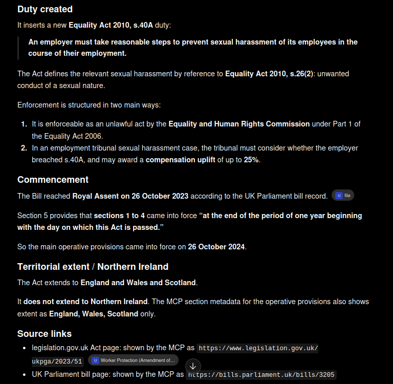
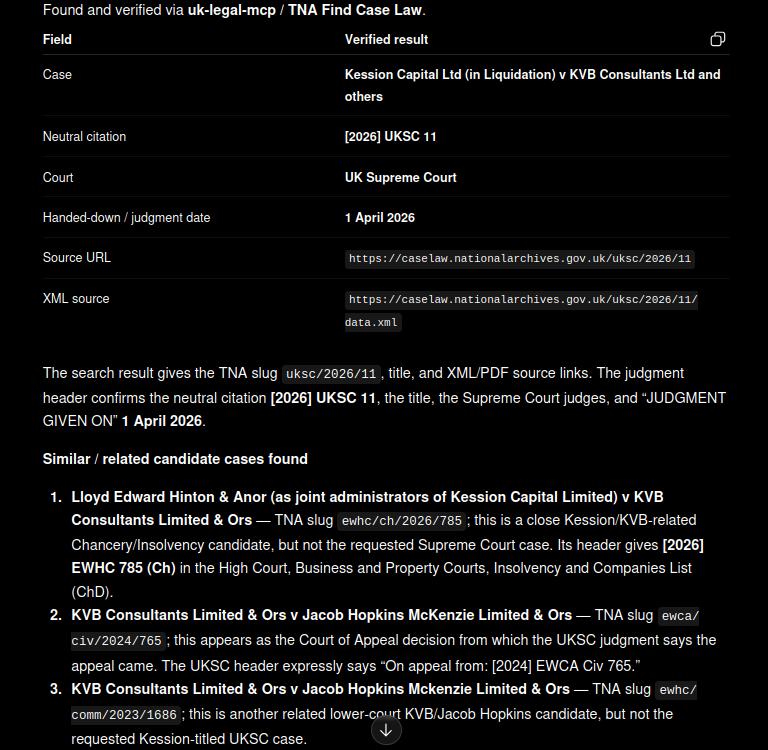
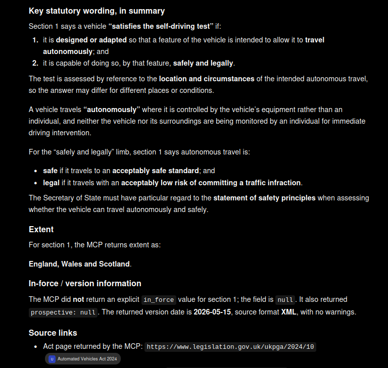
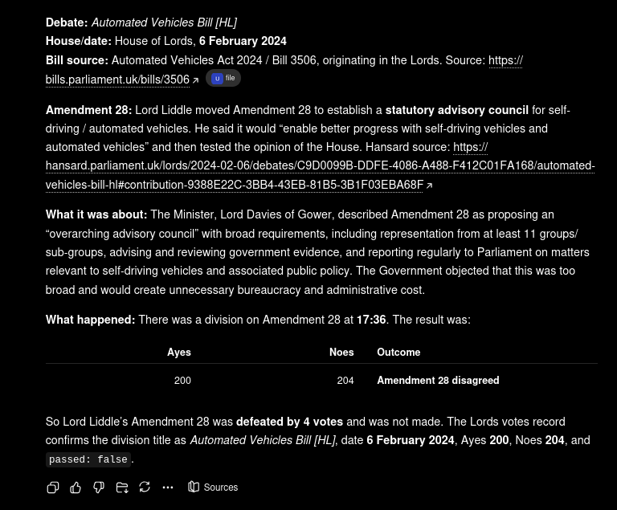
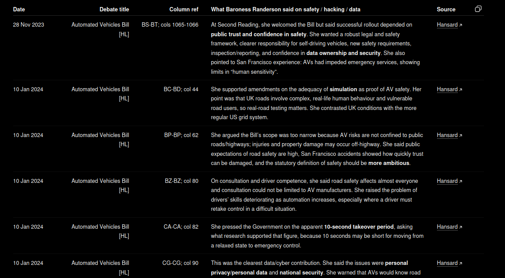
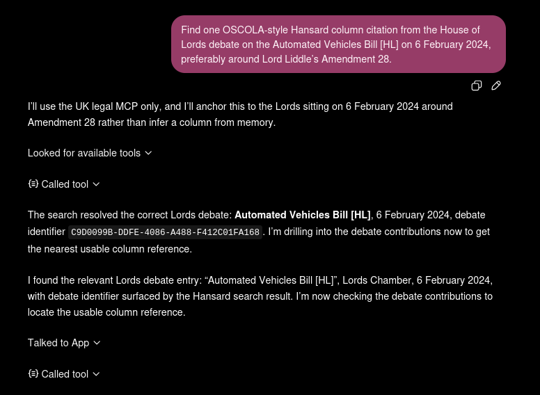
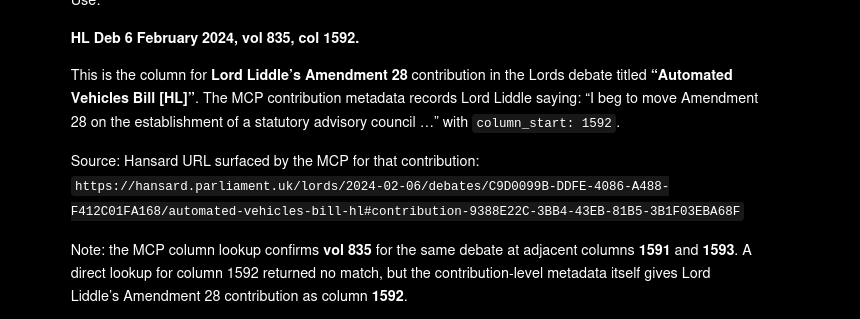

# Lawyer Guide

uk-legal-mcp is most useful when you ask your AI assistant for an evidence pack: the source found, the metadata needed to cite it, and the caveats you should check before relying on it.

**Use project or system instructions to instruct the agent further:**

```text
Only use uk-legal-mcp. Give me the source URL, citation metadata, and any caveats about jurisdiction, version, or uncertainty.
```

The examples below use fresh, non-primed topics rather than the older demo cases used in development tests and tool descriptions.

---

## How To Ask

Good prompts tell the assistant:

- to use `uk-legal-mcp`(or use config files/instructions);
- what source family you need, if you know it;
- what metadata you need back;
- to say when the source does not support a conclusion.

Example:

```text
Only use uk-legal-mcp. Find the relevant source, give me the source URL, quote or summarise the source-backed point, and tell me what still needs checking.
```

Avoid asking for a bare conclusion first. Ask for the evidence first, then apply your judgement.

---

## Legislation: Duty, Commencement, Extent

Prompt:

```text
I am advising an employer with staff in England, Wales and Scotland. Check the Worker Protection (Amendment of Equality Act 2010) Act 2023. What duty does it create, when did the main provisions come into force, and does it extend to Northern Ireland? Only use uk-legal-mcp and give source links.
```

What a good answer should show:

- the Act and section being relied on;
- a source URL for the Act;
- commencement or version information;
- territorial extent, especially whether Northern Ireland is included;
- any uncertainty where the source metadata is limited.



---

## Case Law: Verify The Exact Authority

Prompt:

```text
Find Kession Capital Ltd (in liquidation) v KVB Consultants Ltd and others. Verify the neutral citation, court, handed-down date, and source URL. Only use uk-legal-mcp. If there are similar candidate cases, say so.
```

What the agent did:

1. Searched TNA Find Case Law for the case name.
2. Retrieved the judgment header for the matching Supreme Court result.
3. Verified the neutral citation, court, date, and source URL from source metadata.
4. Checked similar candidate cases and kept them separate from the requested authority.

Why this matters: legal research answers are more trustworthy when they distinguish the exact authority from nearby cases with similar party names.



---

## Legislation: Section Drilldown

Prompt:

```text
For the Automated Vehicles Act 2024, find the section that explains the self-driving test or basic concepts. Give the section number, the key statutory wording in summary, extent, in-force/version information if available, and source links. Only use uk-legal-mcp.
```

What a good answer should show:

- the Act and section number;
- a short source-backed summary of the statutory wording;
- the territorial extent;
- the in-force, prospective, or version-date metadata returned by the source;
- source links for the Act or section.



---

## Hansard: Debate To Division

Prompt:

```text
What happened to Lord Liddle's Amendment 28 on a statutory advisory council during the House of Lords debate on the Automated Vehicles Bill [HL] on 6 February 2024? Only use uk-legal-mcp. Give the debate title, date, what the amendment was about, the division result, and source links.
```

What a good answer should show:

- the debate title and sitting date;
- the relevant contribution or motion;
- the division result, counts, and outcome;
- source links to Hansard and the votes record where available.



---

## Hansard: Member Contributions

Prompt:

```text
Find what Baroness Randerson said about safety, hacking, or data issues in House of Lords debates on the Automated Vehicles Bill [HL]. Only use uk-legal-mcp. Return dated contributions with debate titles, column references if available, and source links.
```

What a good answer should show:

- each contribution date;
- debate title;
- column references where the source provides them;
- source links;
- a source-backed summary of what the member actually said.



---

## Hansard: Column Citation With Caveats

Column citation work can be messy. A good answer should not hide that.

First prompt:

```text
Find one OSCOLA-style Hansard column citation from the House of Lords debate on the Automated Vehicles Bill [HL] on 6 February 2024, preferably around Lord Liddle's Amendment 28. Only use uk-legal-mcp.
```

The assistant first found the debate and drilled into the relevant contribution:



The resulting answer surfaced a useful caveat: the contribution metadata gave a column start, while direct lookup around that column had adjacent matches but not the exact column. That is the kind of uncertainty a legal workflow should preserve.



Use this pattern when checking a citation from an opponent, draft, or old note:

```text
Opposing counsel cites: [PASTE CITATION]. Verify what is actually at that Hansard citation. Only use uk-legal-mcp. Give the debate, speaker, contribution, source link, and any lookup caveat.
```

---

## What This Does Not Do

uk-legal-mcp returns primary source material and metadata. It does not:

- decide whether a source wins your argument;
- classify a speaker as for or against a policy unless the source text clearly supports that;
- replace checking jurisdiction, currency, commencement, or procedural posture;
- remove the need to read the source before relying on it.

The safest pattern is: source first, judgement second.
